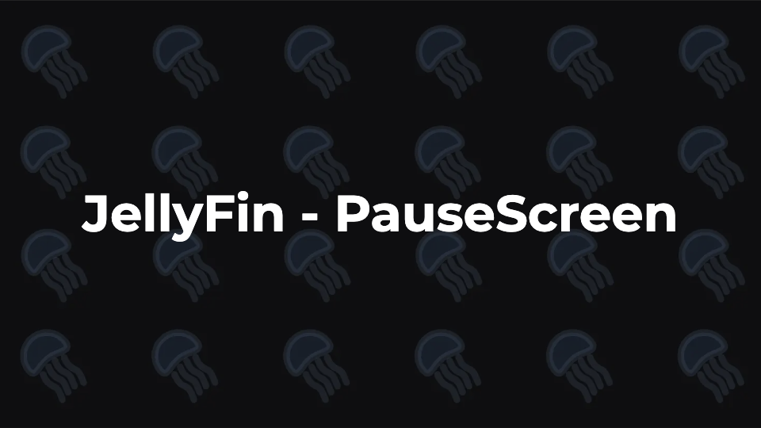

# Jellyfin-PauseScreen

<div align="center">
    <p>
        
    </p>
</div>

This plugin take and builds upon the great work by [`BobHasNoSoul`](https://github.com/BobHasNoSoul/Jellyfin-PauseScreen) with added support for live TV as well as neater styling.


confirmed working on 10.11.0 

A pause screen for jellyfin that adds the logo and the disc and the description when paused that dissapears when playback is resumed or the video is exited.

## Manifest URL

```
https://raw.githubusercontent.com/jampez77/Jellyfin-PauseScreen/main/manifest.json
```

Basically it is able to pick the items logo and the items plot and then from there also grab the items disc and put them on the screen when paused. It does however have fallbacks so lets say you dont put a disc for every item, thats fine it will go to season and then if there isnt one there it will get the series disc image, same for the logo.. the only thing i didnt do like that is the plot.. because that could go very badly.


